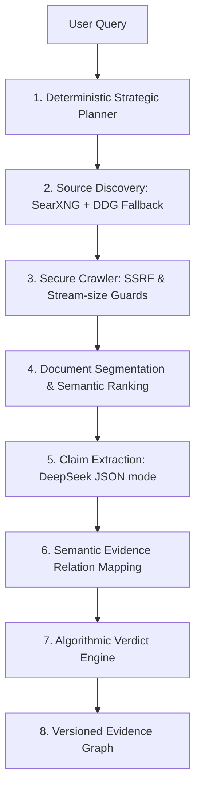

# TruthEngine 🔍

**"TruthEngine is what AI reasoning looks like when security, transparency, and data integrity are treated as first-class engineering constraints."**

[](https://github.com/programmingxpert/TruthEngine)
[](https://www.python.org/)
[](https://opensource.org/licenses/MIT)

TruthEngine is a transparent AI reasoning engine designed to verify factual claims. Unlike typical AI chatbots that present confident answers without verifiable origin, TruthEngine builds an end-to-end audit log of its reasoning process. It discovers, crawls, segments, ranks, extracts, and maps evidence into a **versioned Evidence Graph** before computing a deterministic, rule-based confidence verdict.

It is built as a **Modular Monolith** adhering to Clean Architecture and Domain-Driven Design (DDD) principles.

---

## 🏗️ Architectural Overview

TruthEngine avoids "vibe-based" AI answers by structuring the investigation as an immutable State Machine. The pipeline runs from a user query down to a formal graph database schema:



---

## 🛠️ Core Engineering Highlights (What makes this project hire-worthy)

### 1. Concurrency & Deadlock Resolution (FastAPI Lifecycle Race)
During asynchronous execution under Postgres, we solved a classic transaction deadlock:
* **The Problem**: FastAPI's `BackgroundTasks` execute *after* the response payload is returned, but *before* request-scoped dependency sessions commit/close their transactions. The request thread held a row lock on the investigation record (status: `QUEUED`), while the background runner attempted to transition the status to `COLLECTING_SOURCES` (acquiring the same row lock), causing a permanent hang.
* **The Solution**: Designed an early commit pattern in the router, manual session synchronization, and decoupled background worker loops to safely release the transaction lock prior to executing thread-pool queries.

### 2. Secure Crawler & SSRF Prevention
To protect local and containerized deployments, the scraping pipeline features a rigorous security perimeter:
* **SSRF Guard**: Resolves target domains to IP addresses at the DNS layer using `socket.getaddrinfo` and explicitly rejects private ranges (`127.0.0.1`, `10.0.0.0/8`, link-local, multicast, loopback, and IPv6-mapped equivalents) before initiating any socket connection.
* **Payload Size Limiters**: Uses HTTPX stream buffering to monitor byte sizes chunks-by-chunks, terminating downloads immediately if payloads exceed `5 MB` (preventing ZIP bombs or memory overflow attacks).
* **MIME validation**: Enforces strict `text/html`, `text/plain`, and `application/xhtml+xml` headers.

### 3. Zero-Dependency Search Resilience (DuckDuckGo Fallback)
Datacenter and local container environments often experience internet routing issues or CAPTCHA blocks from major search engines.
* TruthEngine features a self-contained, parsing search provider. If the primary SearXNG instance fails or returns zero results, the engine instantly fallbacks to scraping DuckDuckGo's raw HTML interface. It extracts organic result tags, unpacks redirection parameters, and continues the run without losing state.

### 4. Deterministic Verdict Scoring vs. LLM Hallucinations
We don't ask the LLM to write the executive summary or decide the truth of a claim. The LLM is used only for atomic fact extraction (mapping quotes to claims). The overall verdict (`TRUE`, `FALSE`, `MIXED`, `INSUFFICIENT_EVIDENCE`) is calculated using a rule-based verdict engine that weighs the density and ratio of supporting vs. contradicting evidence relations.

---

## 💻 Tech Stack

* **Backend**: FastAPI, SQLAlchemy 2.0 (declarative mapping, eager joins), Alembic (DB migrations), PostgreSQL, Pytest (unit & integration testing), MyPy (Strict type-checking), Ruff (linting/formatter).
* **Frontend**: React (SPA), Vite, TypeScript (strict compile contracts), Tailwind CSS, React Query (server-state synchronization), Lucide.
* **Services**: Docker Compose, SearXNG.

---

## 🚀 One-Command Launch

### Prerequisites
Create a `.env` file at the root:
```bash
copy .env.example .env
```
Ensure `TRUTHENGINE_DEEPSEEK_API_KEY` is configured:
```text
TRUTHENGINE_DEEPSEEK_API_KEY=your_real_key_here
```

### Run (Docker)
Start the entire stack (Postgres, FastAPI, Vite, SearXNG) in one go:
```bash
docker compose up --build
```
* **Frontend**: `http://localhost:5173`
* **API Documentation**: `http://localhost:8000/docs`
* **Local SearXNG**: `http://localhost:8888`

### Run Natively (SQLite Fallback)
If Docker isn't running, start it natively on your host machine:
```powershell
python run.py
```
*(Or double-click `start.bat` on Windows)*
The service runner automatically detects PostgreSQL absence, initializes a local SQLite file (`truthengine.db`), runs database migrations on-the-fly, and launches both backend and frontend servers concurrently.

---

## 🧪 Testing & Code Quality

The codebase enforces strict linting, styling, and static-type boundaries.

```bash
# Formatter & Linter
ruff format .
ruff check .

# Static Type Check
mypy src tests --strict

# Run Test Suite (28 Integration & Domain Tests)
python -m pytest
```

*Every module is fully typed. Eager loading and transaction scopes are covered under integration tests with 100% test pass compliance.*
