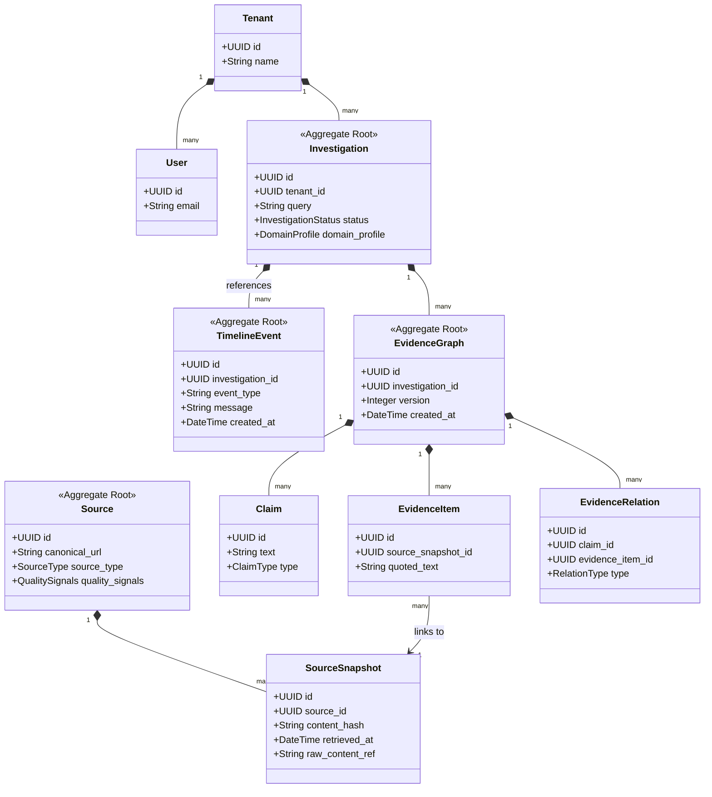

# TruthEngine Product Architecture Review

This document provides a first-principles product architecture review of TruthEngine. It evaluates the investigation lifecycle, aggregate roots, domain relationships, and maps out the long-term domain model and roadmap.

---

## 1. Architectural Evaluation (First Principles)

### A. Is the Investigation Lifecycle Correct?
The current sequential V1 lifecycle:
`CREATED` → `COLLECTING_SOURCES` → `ANALYZING` → `GENERATING_REPORT` → `COMPLETED`
is conceptually simple but has several product limitations:
1. **Lack of Intake Refinement**: It assumes the input query is immediately ready. In practice, a user query might be vague, requiring an intake step to resolve ambiguity (e.g. deciding category, geography, or time scope) *before* crawling.
2. **No Human-In-The-Loop (HITL) Checkpoint**: If crawling collects irrelevant/spam sources, the system proceeds to analyze them blindly. The lifecycle needs a state where collected sources can be reviewed/filtered by the user before running expensive AI extraction.
3. **Linearity vs. Iteration**: Analysis often reveals new claims that require additional search queries. A strictly linear workflow cannot support iterative evidence discovery.

### B. Aggregate Roots & Ownership Boundaries
In DDD, an Aggregate is a cluster of domain objects that can be treated as a single unit for data changes. 
* **The Danger of making "Investigation" the sole Aggregate Root**:
  If every claim, source, snapshot, timeline event, and report belongs directly to `Investigation` in a single transaction/locking boundary, the database will suffer from lock contention, memory bloat, and performance bottlenecks at scale.
* **Proposed Aggregate Decompositions**:
  1. **Investigation Aggregate**: Root is `Investigation`. Owns basic state, settings, query, status, and domain configuration.
  2. **Evidence Graph Aggregate**: Root is `EvidenceGraph` (or `GraphVersion`). Owns `Claim` nodes, `EvidenceItem` nodes, and `EvidenceRelation` edges (supports, contradicts). This represents the immutable, versioned logical state of the audit.
  3. **Source Registry Aggregate**: Root is `Source` (defined by canonical domain/URL). Sources should **not** belong exclusively to one investigation. If a source (e.g., "NIRF 2025 Rankings") is retrieved once, it should be a shared canonical resource accessible across multiple investigations, though each investigation might reference its own `SourceSnapshot`.
  4. **Audit Log Aggregate**: Root is `TimelineEvent`. A write-only append log associated with the investigation but persisted independently to avoid bloating the main record.

---

## 2. Complete Domain Model

### Aggregate & Entity Relationships (UML Diagram)



### Aggregate Ownership Rules
1. **Cross-Boundary References**: Entities in one aggregate must reference the root of another aggregate *only by ID*, not by direct object references. For example, `EvidenceItem` references `SourceSnapshot` via `source_snapshot_id`.
2. **Immutability of the Graph**: Once an `EvidenceGraph` version is created and stored, it is **immutable**. Any edit, annotation, or further evidence addition produces a new `EvidenceGraph` version (e.g. `version=2`).

### Core Invariants
1. **Evidence Grounding**: An `EvidenceRelation` cannot exist without linking to both an atomic `Claim` and a verified `EvidenceItem`.
2. **Snapshot Traceability**: Every `EvidenceItem` must link to a valid `SourceSnapshot` which must have a non-empty `content_hash` and `raw_content_ref`.
3. **No Self-Referential Repetition**: A `Source` cannot cite or repeat itself to artificially inflate its credibility.

---

## 3. Justification of Current Design

We conclude that the **current modular monolith design is strong enough to continue without immediate redesign** before Milestone 3.

### Rationale
* **Pragmatic Relational Schema**: The current SQL structure uses separate tables (`investigations`, `investigation_timeline_events`) with strict primary/foreign keys. While it is monolithic, it does not enforce physical object coupling. We can easily transition to versioned graphs by introducing an `evidence_graphs` table in Milestone 4.
* **Separation of Workflows**: The state transitions and timeline logging are isolated inside `workflow.py` and decoupled from FastAPI HTTP route handlers. This allows us to transition to async execution or add crawlers without corrupting the routes.

---

## 4. Roadmaps (Milestones 3 - 10)

```mermaid
gantt
    title TruthEngine Engineering Roadmap
    dateFormat  YYYY-MM-DD
    section Core Pipeline
    M3: Sandboxed Ingestion            :active, m3, 2026-07-18, 5d
    M4: Evidence Graph Schema          : m4, after m3, 4d
    M5: Claim Extraction Task          : m5, after m4, 5d
    section AI & Analysis
    M6: AI Evidence Matcher            : m6, after m5, 5d
    M7: Contradiction & Missing        : m7, after m6, 4d
    M8: Confidence Calibrator          : m8, after m7, 4d
    section Platform
    M9: Async Workers (Arq/Celery)     : m9, after m8, 5d
    M10: Sharing & Collaboration       : m10, after m9, 5d
```

### Milestone 3: Sandboxed Ingestion Layer
* **Objective**: Implement secure fetching and parsing of external URLs without risking Server-Side Request Forgery (SSRF) or ingesting scripts.
* **Architectural Impact**: Creates `ingestion` module. Exposes HTML parser and snapshot policy managers.
* **Expected Files/Modules**:
  * `src/truthengine/ingestion/` (`fetcher.py`, `sanitizer.py`, `persistence.py`)
  * Migrations creating `sources` and `source_snapshots` tables.
* **Testing Strategy**: Mock network responses using HTTPX Mock; test SSRF isolation limits (e.g. blocking localhost/private IP ranges).
* **Exit Criteria**: API successfully downloads, sanitizes, and snapshots webpage text content to local/object storage.

### Milestone 4: Evidence Graph Storage & Versioning
* **Objective**: Implement database schemas supporting versioned nodes and edges for the evidence graph.
* **Architectural Impact**: Creates the database backbone for explainable AI.
* **Expected Files/Modules**:
  * `src/truthengine/graphs/` (`domain.py`, `persistence.py`, `service.py`)
  * Migrations creating `evidence_graphs`, `claims`, `evidence_items`, and `evidence_relations` tables.
* **Testing Strategy**: Verify that adding a user annotation increments the graph version without mutating historical data.
* **Exit Criteria**: Fully queryable relational graph schemas passing SQLite/PostgreSQL constraint checks.

### Milestone 5: Claim Extraction Task (AI Integration)
* **Objective**: Introduce the first structured AI task to decompose raw text/queries into normalized, atomic claims.
* **Architectural Impact**: Creates `ai_tasks` module and model router.
* **Expected Files/Modules**:
  * `src/truthengine/ai_tasks/` (`executor.py`, `router.py`, `prompts/claim_extraction.py`)
  * Integration with OpenAI/Anthropic SDKs.
* **Testing Strategy**: Assert output conforms to expected Pydantic schemas; evaluate extraction accuracy against a 50-item golden dataset.
* **Exit Criteria**: The system extracts structured claims with 90%+ recall and logs model usage metadata in `model_runs`.

### Milestone 6: AI Evidence Matcher (Retrieval & Extraction)
* **Objective**: Execute web search queries, retrieve top sources, and extract matching passages linking to target claims.
* **Architectural Impact**: Wires search API adapters and AI task executors.
* **Expected Files/Modules**:
  * `src/truthengine/retrieval/` (`search.py`, `adapters.py`)
  * `src/truthengine/ai_tasks/prompts/passage_matching.py`
* **Testing Strategy**: Mock Search API JSON payloads; test passage extraction with varying document lengths.
* **Exit Criteria**: Successfully runs an investigation that collects search results, extracts supportive/contradictory quotes, and saves them in the `EvidenceGraph`.

### Milestone 7: Contradiction & Missing Evidence Analyzers
* **Objective**: Deterministically detect contradictory claims and flag required evidence that was not found in retrieved sources.
* **Architectural Impact**: Extends the `analysis` module.
* **Expected Files/Modules**:
  * `src/truthengine/analysis/` (`contradictions.py`, `missing_evidence.py`)
* **Testing Strategy**: Write unit tests with hardcoded mock graphs containing contradictory statements and verify correct detection.
* **Exit Criteria**: API returns structured contradiction models and missing evidence lists during workflow runs.

### Milestone 8: Explainable Confidence Calibrator
* **Objective**: Compute and explain the confidence level of claims using support bands and multi-factor parameters (recency, quality, contradiction status) instead of naked percentages.
* **Architectural Impact**: Finalizes reasoning calculations in the `analysis` module.
* **Expected Files/Modules**:
  * `src/truthengine/analysis/confidence.py`
* **Testing Strategy**: Verify confidence updates as contradictory evidence is added to the graph.
* **Exit Criteria**: Calibration logic successfully labels claims from `Unsupported` to `Well Supported` with transparent explanations.

### Milestone 9: Asynchronous Workers & Queueing (arq/Celery)
* **Objective**: Move the synchronous workflow orchestration into background workers to prevent blocking the web gateway.
* **Architectural Impact**: Introduces Redis-backed queueing and worker processes.
* **Expected Files/Modules**:
  * `src/truthengine/core/queue.py`
  * `src/truthengine/workers/` (`workflow_worker.py`)
* **Testing Strategy**: Integration tests validating job dispatch, status update tracking, and worker crash recovery.
* **Exit Criteria**: Endpoint `/run` returns HTTP 202 immediately, enqueues the job, and the worker executes the stage transitions asynchronously.

### Milestone 10: Collaboration, Dispute Workflows, & Exports
* **Objective**: Expose the evidence graph through shareable read-only URLs, allow user corrections, and support export formats (Markdown/PDF/JSON).
* **Architectural Impact**: Extends the `presentation` and `investigations` modules.
* **Expected Files/Modules**:
  * `src/truthengine/presentation/` (`exports.py`, `sharing.py`)
* **Testing Strategy**: Verify access token scoping for read-only shared links; test export parsing correctness.
* **Exit Criteria**: Users can toggle investigation sharing, export structured PDF/Markdown bundles, and manually dispute/correct AI-proposed relations.
