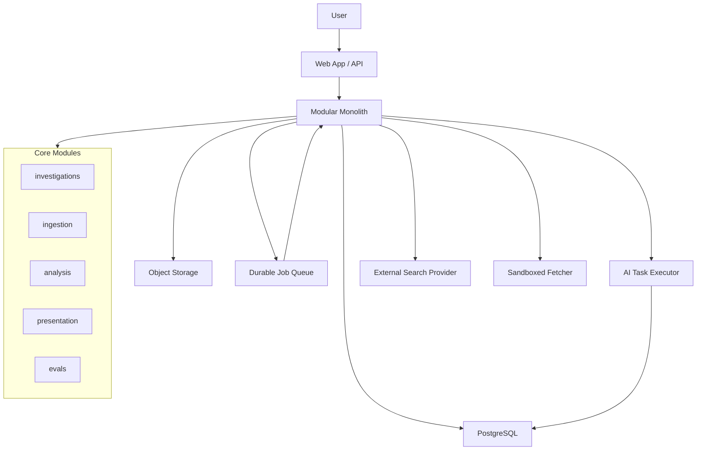
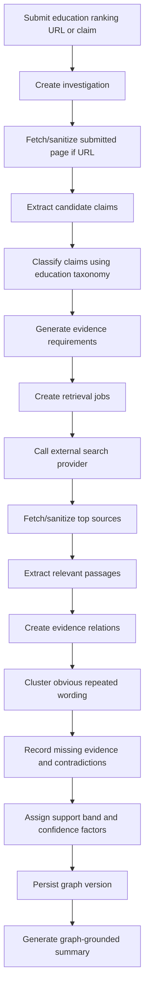

# TruthEngine Brutal Architecture Review

Date: 2026-07-17
Status: Critical review and corrective redesign
Review stance: Google Staff Engineer, Anthropic Infrastructure Engineer, Microsoft Principal Engineer, Senior FastAPI maintainer

## Executive Verdict

The architecture has the right product instincts: graph-first, evidence-first, inspectable reasoning, durable artifacts, and source independence.

But the first architecture draft overestimates how much platform machinery should exist before product-market evidence exists. It risks building a distributed "AI research factory" before proving the smallest trustworthy evidence loop.

The biggest problem is not that the architecture is wrong. The problem is that it is too easy for engineers to implement the nouns literally: Workflow Orchestrator, Agent Runtime, Event Bus, Model Router, Source Registry, Lineage Service, Evidence Graph Service, Search Index, Vector Index, Warehouse, Graph Projection. That is how a startup accidentally builds an expensive internal platform instead of a product.

TruthEngine needs a smaller, harder, more disciplined architecture:

1. One product workflow.
2. One domain.
3. One durable data model.
4. One queue.
5. One AI task abstraction.
6. One source snapshot policy.
7. One eval suite.
8. No fake precision.
9. No autonomous agent theater.
10. No distributed system until the monolith proves where it breaks.

## Critical Findings

## 1. Too Many Services Too Early

Original direction:

- Intake Service
- Claim Service
- Evidence Planning Service
- Retrieval Service
- Source Registry Service
- Snapshot Service
- Evidence Extraction Service
- Lineage Service
- Reasoning Service
- Evidence Graph Service
- Presentation Service
- Agent Runtime
- Model Router

Problem:

This is service sprawl disguised as modularity. A small team will spend more time designing interfaces than discovering the product. The service names are domain-valid, but they should not become physical services or even heavy internal modules yet.

Junior-engineer failure mode:

- Every noun becomes a class.
- Every class gets a repository.
- Every repository gets a service.
- Every service gets an interface.
- The codebase becomes "clean architecture" cosplay with no working product.

Redesign:

For V1, collapse into five modules:

- `investigations`: investigation lifecycle, claims, evidence graph, graph versions.
- `ingestion`: URL fetching, content extraction, source metadata, snapshot policy.
- `analysis`: claim extraction, evidence requirements, evidence relation, contradiction, confidence factors.
- `ai_tasks`: provider calls, structured outputs, model run records, task budgets.
- `presentation`: read models, graph views, summaries, exports.

Keep `identity` and `observability` as cross-cutting infrastructure, not product modules.

Scale path:

Only extract a module into a separate service when there is a measured reason:

- Independent scaling requirement.
- Independent deployment requirement.
- Different security boundary.
- Different data retention boundary.
- Different team ownership boundary.

## 2. "Agent Runtime" Is Too Vague and Dangerous

Original direction:

Agents are specialized workers with names like Claim Extraction Agent, Evidence Planner Agent, Lineage Agent, Confidence Agent, Synthesis Agent.

Problem:

"Agent" is a loaded word. It tempts engineers to build autonomous loops, hidden memory, hidden tool use, and implicit decision-making. TruthEngine cannot afford that. The product is about inspectable reasoning. Agents must be boring, bounded functions with typed inputs and typed outputs.

Anthropic infrastructure concern:

Unbounded agents create prompt injection, runaway cost, non-determinism, and unreviewable behavior. The system should not allow a model to decide the workflow. The workflow should decide when a model is called.

Redesign:

Rename the runtime conceptually:

- From `Agent Runtime`
- To `AI Task Executor`

Each AI task must have:

- task type
- schema version
- allowed tools
- model policy
- max tokens
- max retries
- timeout
- input artifact references
- output schema
- validation rules
- repair policy
- audit record

No AI task should:

- directly write durable domain state
- make network calls unless explicitly delegated through retrieval infrastructure
- choose its own provider
- recursively spawn work without workflow permission
- be trusted without validation

Scale path:

When task volume grows, scale AI task workers by task type. Do not create autonomous "research agents" until the deterministic pipeline is excellent.

## 3. Event Bus and Job Queue Are Conflated

Original direction:

The architecture uses "Event Bus / Job Queue" together.

Problem:

Events and jobs are not the same thing.

- A job is work to do.
- An event is a fact that happened.

Conflating them creates retry bugs, duplicate side effects, and unreadable workflows.

Microsoft principal-engineer concern:

At scale, this becomes an operations nightmare. Engineers will not know whether publishing `ClaimsIdentified` is asking someone to do work or recording history. Dead-letter queues become semantic trash heaps.

Redesign:

For V1:

- Use a durable job queue for work.
- Use a transactional outbox for domain events.
- Store workflow state in PostgreSQL.
- Publish events from the outbox after commit.
- Make all job handlers idempotent.

Do not introduce Kafka or a general event streaming platform until:

- event volume requires it
- multiple independent consumers need replay
- data platform use cases justify it

Scale path:

Start with Postgres-backed outbox plus a queue. Later add Kafka/PubSub only as a projection transport, not as the source of truth.

## 4. Workflow Orchestrator Is Underspecified

Original direction:

Use a Workflow Orchestrator to start, pause, resume, cancel, retry investigations.

Problem:

This is correct at a high level but dangerous without choosing the level of machinery. A first team can easily overbuild Temporal-style workflows before knowing the workflow shape.

Senior FastAPI maintainer concern:

Do not use FastAPI `BackgroundTasks` for durable investigations. They are request-lifecycle conveniences, not reliable workflows. Process restarts will lose work. Retries, cancellation, observability, and idempotency will be poor.

Redesign:

V1 should use:

- PostgreSQL `investigation_steps` table.
- Durable job queue.
- Step state machine.
- Explicit idempotency keys.
- Retry policy per step.
- Dead-letter handling.

Only adopt Temporal/Durable Functions/Conductor later if:

- workflows become deeply branching
- long-running steps need durable timers
- cancellation/resume semantics become complex
- operational team can support the system

Scale path:

The step table becomes the migration bridge into a real workflow engine if needed.

## 5. Search Index and Vector Index Are Premature as Core Architecture

Original direction:

The system includes search and vector indexes in the first architecture.

Problem:

These are not free. They add data consistency, privacy, ingestion, deletion, relevance debugging, and cost problems. A V1 webpage audit product may not need an internal search or vector index.

Google staff-engineer concern:

Do not introduce a distributed index before you know the query patterns. Most early retrieval will be external web search plus local analysis of a small result set.

Redesign:

V1:

- Use external search providers for web discovery.
- Store retrieved sources and evidence in PostgreSQL/object storage.
- Use PostgreSQL full-text search only for internal review if needed.
- Use embeddings only behind a narrow interface for near-duplicate detection experiments.

Not V1:

- Dedicated vector database.
- Dedicated search cluster.
- Large-scale crawler.
- Global claim index.

Scale path:

Add dedicated indexes only after measured query volume, latency, or relevance needs justify them.

## 6. Confidence Percentages Are Dangerous

Original direction:

Examples show confidence like 18%.

Problem:

This creates fake precision. Unless TruthEngine has calibrated confidence models against domain-specific golden datasets, numeric confidence percentages are misleading and legally risky.

Redesign:

V1 should use confidence bands:

- Unsupported
- Weakly supported
- Partially supported
- Well supported
- Conflicting evidence
- Not enough evidence found

If a score exists internally, expose the factors, not an exact percentage. Numeric confidence can come later only after calibration.

Scale path:

Introduce calibrated numeric confidence per domain only when evals show reliable calibration.

## 7. Source Snapshotting Needs a Legal and Security Policy

Original direction:

Source snapshots are non-negotiable.

Problem:

Full-page snapshotting can create copyright, privacy, retention, malware, and compliance issues. It is technically correct but operationally under-specified.

Security concern:

Ingested webpages are hostile. They can include prompt injection, tracking, malicious files, hidden text, or sensitive personal data.

Redesign:

V1 snapshot policy:

- Store source URL, retrieval timestamp, content hash, title, publisher metadata.
- Store short relevant extracted passages within legal/product limits.
- Store full raw HTML only when allowed by policy and necessary.
- Store rendered screenshots only for user-submitted audits or high-value evidence, subject to retention policy.
- Keep raw snapshots in object storage with restricted access.
- Never feed raw webpage instructions directly into model prompts without sanitization.

Scale path:

Develop per-domain and per-source retention policies before broad crawling.

## 8. "Source Reputation" Is a Trap

Original direction:

Potential later source reputation service.

Problem:

Source reputation sounds useful but can become opaque authority scoring. It can reproduce institutional bias, create defamation risk, and distract from claim-level evidence.

Redesign:

Replace "source reputation" with source quality signals:

- source type
- independence from claimant
- methodology transparency
- citation behavior
- correction history where known
- conflict of interest
- publication date

Do not produce a global reputation score in V1.

Scale path:

If a reputation system is ever built, it must be explainable, domain-specific, appealable, and evidence-backed.

## 9. Lineage Detection Is Being Overpromised

Original direction:

TruthEngine attempts claim origin and repetition tracing.

Problem:

This is one of the hardest parts of the product. The architecture should not imply reliable origin detection. The web's timestamps are messy, pages change, syndication is hidden, and AI content paraphrases.

Redesign:

Use "lineage hypotheses" everywhere.

V1 lineage signals:

- exact citation links
- near-duplicate text
- shared quotes
- publication timestamps
- obvious press release reuse
- canonical URLs

V1 output:

- "Likely repeated from..."
- "Shares wording with..."
- "No independent verification found in retrieved sources..."
- never "the origin is..." unless directly evidenced.

Scale path:

Add archival lookup, web-scale near-duplicate indexes, and citation graph analysis later.

## 10. Domain Scope Is Still Too Broad

Original direction:

Initial scope mentions education and SaaS marketing claims.

Problem:

Two domains is already too much for V1. Education ranking claims and SaaS security claims require completely different evidence standards.

Redesign:

Pick one.

Best V1 wedge:

Education ranking and school/university marketing claims.

Why:

- The founder repeatedly used this example.
- Evidence standards are concrete: rankings, accreditation, government data, placement reports.
- Marketing abuse is common and visible.
- Users understand the harm.

SaaS comes later.

Scale path:

After the education profile works, add SaaS as the second domain with its own evidence profile and eval set.

## 11. Multi-Tenant Enterprise Architecture Is Premature

Original direction:

Tenant, plan, enterprise policy, provider policy, team workspace.

Problem:

Enterprise readiness is expensive. It can distort the first product with RBAC, billing, retention, regional controls, and audit admin surfaces before there are users.

Redesign:

V1 should support:

- user accounts
- private investigations
- public/shareable investigation links if enabled
- basic workspace later

Do not build:

- complex RBAC
- enterprise policy engines
- custom provider routing per tenant
- region-specific deployments

Scale path:

Keep `tenant_id` in core tables if cheap, but do not build full enterprise workflows until needed.

## 12. Plugin Architecture Is Good, But Over-Specified

Original direction:

AI provider plugins declare many capabilities, costs, privacy terms, regional availability, rate limits, retry semantics.

Problem:

Correct direction, too much surface area. Over-designed plugin contracts become impossible to implement consistently.

Redesign:

V1 provider interface:

- generate structured output
- generate text
- create embeddings if enabled
- provider/model metadata
- timeout/retry behavior
- usage/cost return

Everything else can be capability flags added when needed.

Scale path:

Evolve the provider interface from actual tasks and eval data, not speculation.

## 13. Presentation Read Models Can Become Stale Lies

Original direction:

Use derived read models for UI performance.

Problem:

Read models are necessary eventually, but stale evidence views can undermine trust. If the graph and presentation diverge, users may inspect outdated reasoning.

Redesign:

V1:

- Read directly from PostgreSQL for investigation graph views.
- Add narrow cached projections only for expensive views.
- Every projection must include `graph_version_id`.

Scale path:

Introduce read models when graph read latency becomes a measured bottleneck.

## 14. Evaluation Is Correct But Needs to Be Smaller and Earlier

Original direction:

Large eval strategy across many domains.

Problem:

Good ambition, but without a first domain it becomes abstract. Evals must be built before model prompts stabilize.

Redesign:

Before production:

- 50 hand-labeled education marketing claims.
- 20 unsupported ranking claims.
- 20 supported ranking claims.
- 10 ambiguous/vague claims.
- expected claim classification
- expected evidence requirement
- expected missing evidence outcome
- expected source independence notes

Scale path:

Grow to hundreds per domain before numeric confidence or automation-heavy workflows.

## 15. Observability Is Missing Cost and Quality Kill Switches

Original direction:

Good metrics list, but not enough operational control.

Problem:

AI systems fail by cost explosion and silent quality degradation, not only downtime.

Redesign:

Add hard controls:

- per-investigation cost budget
- per-user daily budget
- per-provider circuit breakers
- per-task token limits
- runaway workflow detector
- eval regression release gate
- "disable deep analysis" feature flag
- queue backpressure that degrades gracefully

Scale path:

Budget enforcement becomes product packaging and infrastructure protection.

## Corrected V1 Architecture

V1 architecture properties:

- One deployable backend.
- One database.
- One durable queue.
- One object store.
- One external search abstraction.
- One AI task executor.
- One domain evidence profile.
- Direct graph reads from the database.
- Strict audit records for model runs and evidence decisions.
- No graph database.
- No internal search cluster.
- No vector database unless hidden behind an experimental interface.
- No autonomous agents.
- No enterprise policy engine.

## Corrected V1 Request Lifecycle

## Non-Negotiable Corrections

1. V1 is not a platform. It is a narrow product proving one evidence loop.
2. Agents are typed AI tasks, not autonomous actors.
3. PostgreSQL is the source of truth. Everything else is optional or derived.
4. A job is not an event.
5. Use confidence bands, not exact percentages, until calibrated.
6. Store source evidence responsibly; do not blindly snapshot the internet.
7. Lineage is a hypothesis, not a truth claim.
8. Pick one first domain.
9. Build evals before claiming quality.
10. Do not introduce a graph database, vector database, Kafka, or enterprise policy engine in V1 without measured need.

## Revised First Production System

Recommended first production system:

- Domain: education ranking and school/university marketing claims.
- Interface: Webpage Audit Mode plus pasted claim audit.
- Backend: modular monolith.
- API: framework choice can be FastAPI, Node, or another mature web framework, but workflows must not depend on request-local background tasks.
- Database: PostgreSQL.
- Queue: simple durable queue with idempotent workers.
- Storage: object storage for controlled source artifacts.
- AI: typed AI task executor with provider adapter.
- Search: external search provider behind an interface.
- Evals: small golden dataset required before release.
- Confidence: support bands plus factors.
- Observability: traces, structured logs, cost budgets, quality metrics.

## Final Review Position

The original architecture is directionally right for a mature TruthEngine, but too heavy for the first production system.

The corrected architecture is deliberately smaller. That is not a lack of ambition. It is how the company avoids dying under its own abstractions before it proves the evidence product works.

