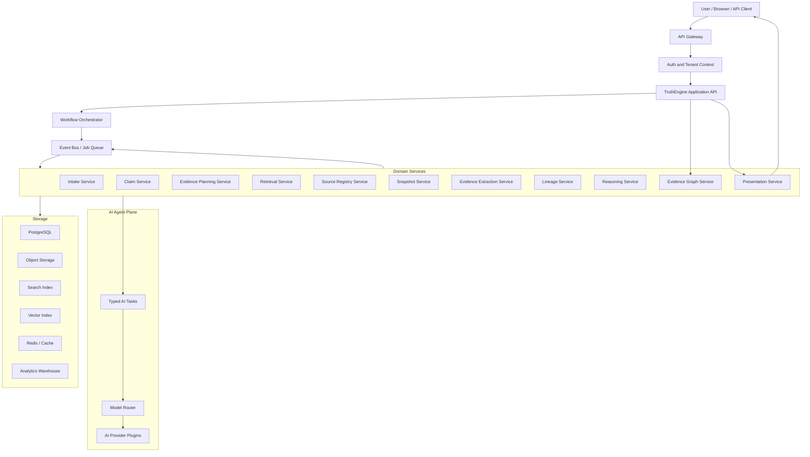
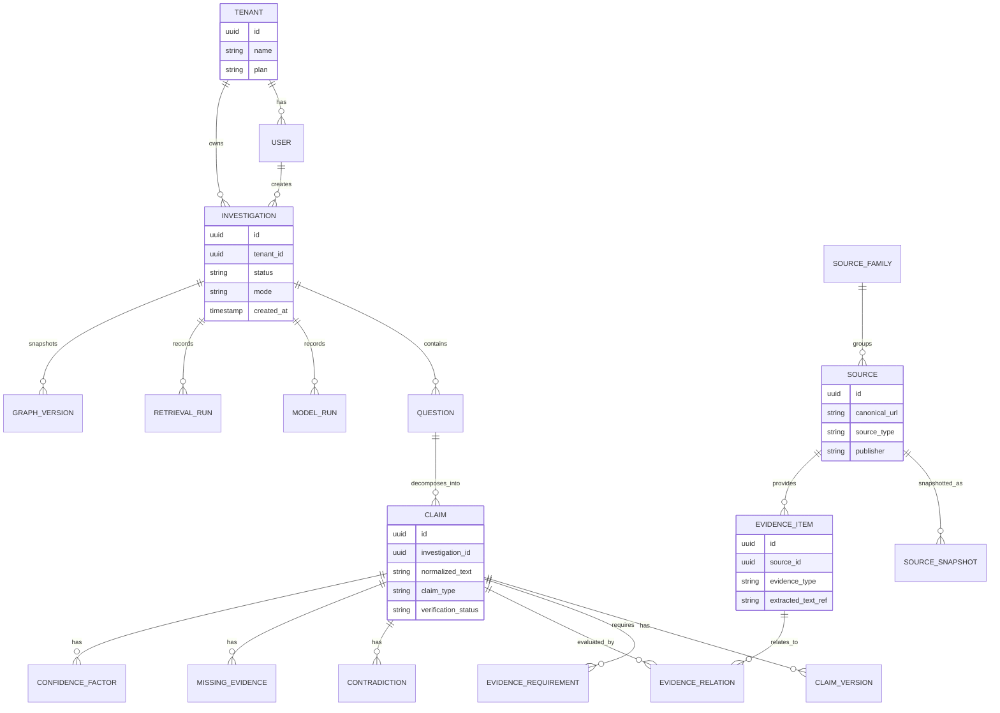
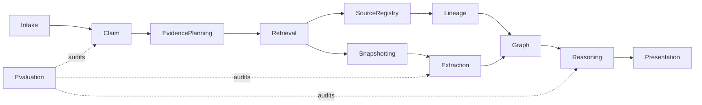
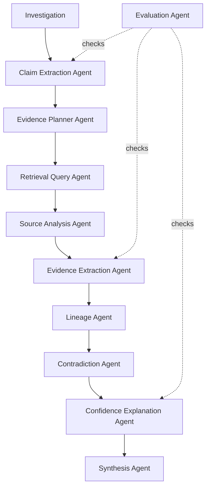
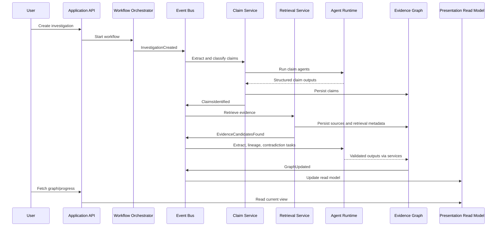
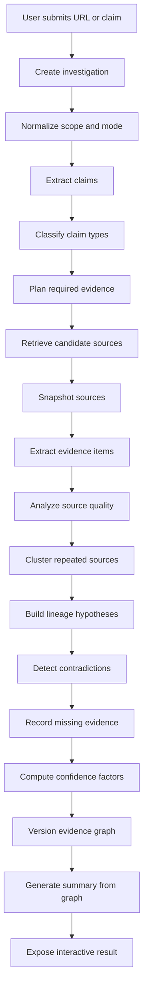
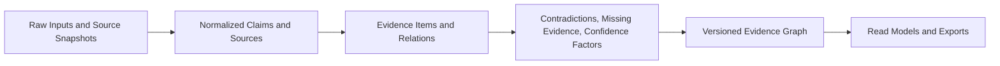
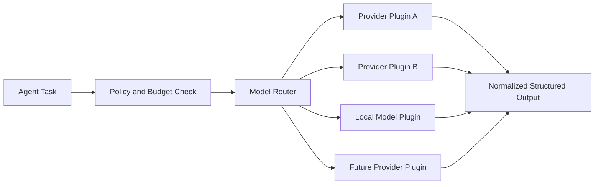
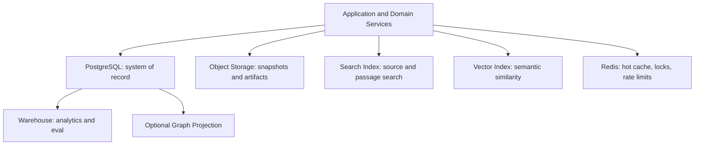

# TruthEngine Software Architecture

Date: 2026-07-17
Status: Founding production architecture blueprint, revised after critical architecture review
Audience: engineering, product, research, security, operations, agentic coding systems

## Purpose

This document translates the TruthEngine vision into an internal software architecture that can grow from a first production system into a platform capable of supporting millions of investigations, many engineers, multiple AI providers, and long-running evidence workflows.

No implementation code is specified here. This is the architectural contract the implementation should respect.

Important review note:

This document originally described a broad platform architecture. After critical review, the V1 architecture is intentionally narrower. The mature architecture remains useful as a direction of travel, but the first production system must not implement every component literally.

The detailed critique and corrected V1 design live in `docs/TRUTHENGINE_ARCHITECTURE_REVIEW.md`.

## Critical Corrections From Architecture Review

The following corrections supersede any broader interpretation in this document:

1. V1 is a narrow product, not a general evidence platform.
2. The first domain should be education ranking and school/university marketing claims unless the founder explicitly changes it.
3. Use a modular monolith first. Do not create physical services for each bounded context.
4. Collapse V1 modules to `investigations`, `ingestion`, `analysis`, `ai_tasks`, `presentation`, and `evals`.
5. Replace the vague "Agent Runtime" mental model with a typed `AI Task Executor`.
6. Agents must not directly write durable state or autonomously control workflow.
7. A job queue and event log are different things. V1 should use a durable job queue plus transactional outbox.
8. Do not introduce Kafka, a graph database, a vector database, an internal search cluster, or an enterprise policy engine in V1 without measured need.
9. Use confidence bands and factor explanations, not exact confidence percentages, until domain calibration exists.
10. Treat lineage as a probabilistic hypothesis, not a fact.
11. Snapshot sources under an explicit legal/security policy; do not blindly store full webpages.
12. Build a small domain-specific golden eval set before production release.

## Architectural North Star

TruthEngine should be built around durable evidence reasoning, not chat completion.

The central architectural object is an investigation graph:

- Questions become claims.
- Claims require evidence.
- Evidence comes from sources.
- Sources have lineage and independence.
- Reasoning produces confidence factors, contradictions, and missing evidence.
- Summaries are generated from graph state.

The system should be modular, observable, auditable, and provider-agnostic. Every important operation should leave a traceable artifact.

## 1. Overall Software Architecture

TruthEngine should start as a modular monolith with strong internal boundaries and asynchronous workers. The codebase should be organized so bounded contexts can later be extracted into independent services, but V1 should not physically split them.

### Recommended Shape



### Architectural Decision: Modular Monolith First, Extractable Services Later

Why:

- The domain is complex and still evolving.
- A premature microservice architecture would slow learning.
- Strong module boundaries give maintainability without distributed-system overhead.
- Millions of requests are more likely to be constrained by workflow throughput, retrieval, AI provider limits, and storage than by whether the first deployment is physically split into many services.

Alternatives:

- Full microservices from day one.
- Single unstructured monolith.
- Serverless-only functions.

Tradeoffs:

- Modular monolith is faster to develop and easier to refactor, but requires discipline around boundaries.
- Microservices improve independent scaling later, but create operational and schema coordination cost early.
- Serverless-only can simplify deployment, but long-running evidence workflows and graph consistency need stronger orchestration than ad hoc functions.

Future scalability:

- Bounded contexts should expose interfaces as if they were network services.
- High-throughput contexts such as retrieval, extraction, lineage analysis, and embedding generation can be extracted first.
- The API layer, workflow layer, and worker fleet can scale horizontally independently.

### Architectural Decision: Async Workflow-Centric Processing

Why:

- Evidence investigations are long-running, multi-step, failure-prone workflows.
- Retrieval, extraction, model calls, lineage analysis, and contradiction analysis should run independently and retry safely.
- Users need progressive results rather than waiting for a single blocking response.

Alternatives:

- Single synchronous request/response pipeline.
- Batch-only offline processing.
- Agent-only autonomous loop without deterministic workflow boundaries.

Tradeoffs:

- Async workflows add operational complexity and require idempotency.
- They make partial results, retries, cancellation, and observability much stronger.

Future scalability:

- Worker pools can scale per task type.
- Expensive stages can be rate-limited independently.
- Investigation depth can be tiered by user plan, domain, or urgency.

## 2. Domain Model

TruthEngine's domain model should be explicit, graph-shaped, and versioned.



### Architectural Decision: Graph-Shaped Domain with Relational Durability

Why:

- Evidence reasoning is naturally graph-shaped.
- Early production needs transactional integrity, migrations, auditability, and team familiarity.
- PostgreSQL can store graph-shaped entities and relations reliably before a dedicated graph database is justified.

Alternatives:

- Native graph database first.
- Document database first.
- Vector database as primary store.

Tradeoffs:

- PostgreSQL is less ergonomic for deep graph traversals but much stronger for core product durability.
- A graph database may become useful for lineage exploration at scale, but adopting it too early increases operational burden.
- Vector stores are retrieval indexes, not sources of truth.

Future scalability:

- Keep graph relations explicit.
- Add read-optimized graph projections later.
- Use event-driven projections into a graph database when traversal needs outgrow relational queries.

## 3. Core Entities

| Entity | Responsibility | Why It Exists |
| --- | --- | --- |
| Tenant | Organization boundary for data, billing, policy, and access control. | Multi-user trust systems need strict ownership boundaries. |
| User | Human actor who creates, reviews, annotates, or exports investigations. | User actions must be auditable. |
| Investigation | Durable container for one evidence reasoning task. | Allows long-running workflows, collaboration, and replay. |
| Question | User's original information need. | Preserves intent before decomposition. |
| Claim | Atomic factual or pseudo-factual statement to evaluate. | TruthEngine reasons over claims, not paragraphs. |
| Claim Version | Versioned normalized claim text and classification. | Claim interpretation can change as analysis improves. |
| Evidence Requirement | Defines what would support or contradict a claim. | Prevents blind retrieval and makes standards explicit. |
| Retrieval Run | Records queries, providers, parameters, and results. | Required for reproducibility and retrieval-scope honesty. |
| Source | Canonical publisher, page, document, dataset, or registry. | Evidence must be tied to source identity. |
| Source Snapshot | Captured state of source content at retrieval time. | Websites change; evidence needs temporal durability. |
| Source Family | Cluster of sources sharing origin, ownership, syndication, or dependency. | Prevents repeated evidence from masquerading as independent evidence. |
| Evidence Item | Specific passage, measurement, quote, row, chart, or document fragment. | The inspectable unit of support or contradiction. |
| Evidence Relation | Relationship between evidence and claim. | Enables support, contradiction, qualification, and irrelevance to be explicit. |
| Lineage Hypothesis | Probabilistic model of origin and repetition. | Claim origin is often uncertain but still valuable. |
| Contradiction | Structured disagreement between claims, sources, or evidence. | Conflicts must be visible rather than averaged away. |
| Missing Evidence | Explicit marker for evidence that should exist but was not found. | Absence or retrieval failure is part of the reasoning state. |
| Confidence Factor | Decomposed confidence contribution. | Avoids unexplained confidence scores. |
| Agent Task | Unit of AI-assisted work with inputs, outputs, and evaluation metadata. | Agents must be auditable and retryable. |
| Model Run | Provider, model, prompt, structured output, token/cost metadata. | AI decisions must be traceable and replaceable. |
| Graph Version | Immutable snapshot of investigation graph state. | Enables audit, sharing, and reproducible summaries. |
| User Annotation | Human note, correction, dispute, or judgment. | TruthEngine should support critical inspection, not just automation. |

### Architectural Decision: Version Important Reasoning Artifacts

Why:

- Claims, graph state, model outputs, source snapshots, and confidence explanations may change over time.
- Users need to understand what the system believed at a point in time.
- Debugging trust systems requires replayable history.

Alternatives:

- Store only latest state.
- Store logs but no semantic versions.

Tradeoffs:

- Versioning increases storage and schema complexity.
- It makes auditability, rollback, comparison, and evaluation dramatically stronger.

Future scalability:

- Older versions can be compacted, archived, or moved to cold storage.
- Immutable graph versions can support shareable evidence bundles.

## 4. Bounded Contexts

Bounded contexts define ownership. Each context should have its own domain services, repositories, events, tests, and public interfaces.



| Context | Owns | Does Not Own |
| --- | --- | --- |
| Identity and Tenancy | users, tenants, roles, policy context | claim reasoning |
| Intake | request normalization, modes, scope | evidence ranking |
| Claim Understanding | claim extraction, normalization, classification | retrieval execution |
| Evidence Planning | evidence standards, required evidence types | source crawling |
| Retrieval | search queries, provider results, retrieval runs | source quality scoring |
| Source Registry | canonical sources, publishers, source families | evidence relation judgments |
| Snapshotting | raw source capture, content hashes, archive references | claim-level reasoning |
| Evidence Extraction | passages, measurements, relevance candidates | final confidence |
| Lineage and Independence | repetition clusters, origin hypotheses, independence score | summaries |
| Evidence Graph | nodes, edges, graph versions, consistency | external retrieval |
| Reasoning | support aggregation, contradictions, missing evidence, confidence factors | raw source capture |
| Presentation | graph views, summaries, exports | domain truth decisions |
| Evaluation | benchmarks, eval runs, regression metrics | production user decisions |
| Observability and Operations | logs, traces, metrics, budgets | business domain logic |

### Architectural Decision: Bounded Contexts Before Physical Services

Why:

- Team growth creates code ownership pressure before infrastructure scaling pressure.
- Clear boundaries let new engineers contribute without corrupting the reasoning model.
- Boundaries make eventual service extraction possible.

Alternatives:

- Organize by technical layer only: controllers, services, repositories.
- Organize by UI feature only.

Tradeoffs:

- Domain boundaries require more upfront thinking.
- They prevent accidental coupling between model prompts, retrieval, storage, and presentation.

Future scalability:

- Retrieval, Source Registry, Lineage, Evaluation, and Presentation are natural candidates for separate services.

## 5. Service Responsibilities

### API Gateway

Responsibilities:

- Authentication entry point.
- Rate limiting.
- Request size limits.
- Request correlation IDs.
- API version routing.

Why:

- External traffic needs one hardened edge.

Alternatives:

- Direct service exposure.
- Client-side orchestration.

Tradeoffs:

- Gateway adds a hop but centralizes cross-cutting controls.

Future scalability:

- Gateway can shard traffic by tenant, region, or workload class.

### Application API

Responsibilities:

- User-facing commands and queries.
- Investigation creation.
- Graph read APIs.
- Export APIs.
- Progressive status APIs.

Why:

- Keeps external API stable while internal workflows evolve.

### Workflow Orchestrator

Responsibilities:

- Start, pause, resume, cancel, and retry investigations.
- Enforce stage order and concurrency limits.
- Track progress.
- Emit domain events.

Why:

- Evidence reasoning is not a single function call.

Alternatives:

- Queue-only choreography.
- Fully autonomous agent loop.

Tradeoffs:

- A workflow engine introduces complexity.
- It prevents invisible state machines scattered across workers.

Future scalability:

- Deep investigations can run as durable workflows across many workers.

### Domain Services

Each bounded context should expose command handlers and query handlers. Domain services should not call AI providers directly. They should request agent tasks through the Agent Runtime.

Why:

- Keeps AI implementation replaceable.
- Prevents prompts from becoming hidden business logic.

### AI Task Executor

Responsibilities:

- Execute typed AI tasks.
- Route model calls.
- Validate structured outputs.
- Record model runs.
- Enforce budgets and policies.
- Retry safe failures.

Why:

- AI tasks are infrastructure-assisted domain operations, not magical side processes.
- The workflow decides when AI is used. AI does not decide the workflow.

### Model Router

Responsibilities:

- Select provider/model by task capability, cost, latency, privacy, and eval score.
- Support fallbacks.
- Normalize provider responses.

Why:

- TruthEngine must not become locked into one AI provider.

## 6. Agent Responsibilities

Agents should be treated as specialized, bounded, observable AI tasks. They should produce structured outputs that domain services validate before persisting. Avoid autonomous agent loops in V1.



| Agent | Input | Output | Guardrail |
| --- | --- | --- | --- |
| Claim Extraction Agent | user question, webpage text, document text | atomic claims and implied claims | preserve original wording and uncertainty |
| Claim Classification Agent | claims | claim type, verifiability, ambiguity | use controlled taxonomy |
| Evidence Planner Agent | claim, domain profile | required evidence checklist | must explain evidence standard |
| Retrieval Query Agent | evidence requirements | search queries and retrieval plan | cannot fabricate sources |
| Source Analysis Agent | source metadata and content | source type, incentives, quality signals | distinguish authority from independence |
| Evidence Extraction Agent | source snapshots, claims | candidate passages and relations | every relation must cite a passage reference |
| Lineage Agent | sources, passages, timestamps, citations | source family and origin hypotheses | lineage must be probabilistic |
| Contradiction Agent | evidence relations | contradictions and qualifications | must preserve context and definitions |
| Confidence Agent | graph state | confidence factors and explanation | no naked score without factors |
| Synthesis Agent | graph version | human-readable summary | summary must link to graph nodes |
| Evaluation Agent | task outputs, golden sets | quality scores and regressions | never mutates user-facing reasoning directly |
| Safety Agent | retrieved content and prompts | prompt-injection and abuse flags | treats external text as untrusted |

### Architectural Decision: AI Tasks Write Through Domain Services

Why:

- AI task outputs need validation, permissions, versioning, and audit logs.
- Direct database writes from AI tasks would make reasoning hard to trust.

Alternatives:

- Give AI tasks direct database access.
- Keep AI calls stateless and return only final answers.

Tradeoffs:

- Write-through services add boilerplate.
- They preserve consistency and allow deterministic validation.

Future scalability:

- AI task workers can move to independent worker pools without changing domain invariants.

## 7. Communication Flow Between Services

TruthEngine should use a hybrid communication model:

- Synchronous calls for user commands and low-latency graph reads.
- Durable jobs for workflow stages and expensive work.
- Domain events for recording facts that already happened.
- Read models for UI views.



### Architectural Decision: Jobs Are Not Events

Why:

- Jobs express work to do.
- Events record facts that already happened.
- Keeping them separate prevents duplicate side effects and retry confusion.

Alternatives:

- Use an event bus as a job queue.
- Use synchronous calls for every workflow step.
- Event-source everything from day one.

Tradeoffs:

- Separate jobs and events require more explicit plumbing.
- The result is easier to debug, retry, and audit.

Future scalability:

- Jobs can scale by worker type.
- Events can later feed projections, analytics, public evidence feeds, and replay systems.

## 8. Request Lifecycle

Example: user audits a university webpage claiming "India's No. 1 private university."



Lifecycle states:

- `created`
- `intake_normalized`
- `claims_identified`
- `evidence_requirements_planned`
- `retrieval_in_progress`
- `evidence_extraction_in_progress`
- `lineage_analysis_in_progress`
- `reasoning_in_progress`
- `ready_with_partial_results`
- `complete`
- `failed`
- `cancelled`

### Architectural Decision: Progressive Results

Why:

- Deep evidence work may take seconds to minutes.
- Users benefit from seeing claims and early source findings while deeper lineage analysis continues.

Alternatives:

- Block until complete.
- Only email/export when finished.

Tradeoffs:

- Progressive UI requires stable partial states.
- It makes the product feel transparent and supports trust.

Future scalability:

- Different plans can offer different depth levels while using the same lifecycle.

## 9. Internal Data Flow

TruthEngine should separate raw data, normalized data, reasoning data, and presentation data.



Data flow rules:

- Raw external content is immutable once snapshotted.
- Normalized artifacts can be versioned.
- Reasoning artifacts must reference specific graph versions.
- Presentation models are derived and can be rebuilt.
- Summaries must never be the only place a conclusion exists.

### Architectural Decision: Derived Read Models

Why:

- Graph data is rich but not always efficient for UI queries.
- Presentation may need claim lists, timelines, source clusters, and confidence breakdowns.

Alternatives:

- Query graph store directly for every UI view.
- Store only denormalized documents.

Tradeoffs:

- Read models require projection logic.
- They improve UI performance and make large-scale reads cheaper.

Future scalability:

- Read models can be cached, replicated, and regionally distributed.

## 10. Event Flow

Core event families:

- Investigation events.
- Claim events.
- Retrieval events.
- Source events.
- Evidence events.
- Lineage events.
- Reasoning events.
- Presentation events.
- Evaluation events.
- Operations events.

Example events:

```text
InvestigationCreated
InvestigationScopeNormalized
ClaimsIdentified
ClaimClassified
EvidenceRequirementsPlanned
RetrievalRunStarted
RetrievalResultFound
SourceCanonicalized
SourceSnapshotted
EvidenceItemExtracted
EvidenceRelationProposed
EvidenceRelationAccepted
SourceFamilyClustered
LineageHypothesisCreated
ContradictionDetected
MissingEvidenceRecorded
ConfidenceFactorsComputed
GraphVersionCreated
SummaryGenerated
InvestigationCompleted
InvestigationFailed
```

Event design rules:

- Events are immutable.
- Events have schema versions.
- Events include tenant, investigation, correlation, and causation IDs.
- Events do not contain large raw content; they reference stored objects.
- Event handlers are idempotent.
- Events should describe domain facts, not implementation details.

### Architectural Decision: Durable Jobs Plus Transactional Outbox Initially

Why:

- TruthEngine needs auditability and async processing.
- Full event sourcing for all state would slow initial development.
- A transactional outbox keeps database state and emitted events consistent.

Alternatives:

- Full event sourcing.
- No events, only database state.
- Kafka/PubSub as the first workflow backbone.

Tradeoffs:

- Hybrid state plus events is pragmatic but requires clarity about source of truth.
- Core database remains authoritative; events drive workflows and projections.
- The outbox adds operational plumbing but avoids dual-write bugs.

Future scalability:

- Selected contexts can adopt event sourcing later if replay needs justify it.
- Kafka or PubSub can be added later as a projection transport.

## 11. Error Handling Strategy

TruthEngine should treat failure as expected, especially in retrieval and AI-assisted analysis.

### Error Categories

| Category | Examples | Strategy |
| --- | --- | --- |
| User input errors | invalid URL, unsupported file type | fail fast with clear message |
| Scope errors | claim too vague, missing domain context | mark as needs clarification or missing definition |
| Retrieval errors | timeout, blocked site, search provider failure | retry, fallback provider, record retrieval limitation |
| Snapshot errors | dynamic page failure, paywall, robots restriction | record source access issue |
| AI provider errors | timeout, rate limit, invalid structured output | retry, fallback model, validate output |
| Domain validation errors | evidence relation lacks source reference | reject output and create repair task |
| Consistency errors | graph invariant violation | stop affected workflow stage and alert |
| Security errors | prompt injection, malicious content | quarantine or sanitize and flag |
| Infrastructure errors | database unavailable, queue lag | circuit breaker and operational alert |

### Architectural Decision: Partial Failure Is a First-Class Result

Why:

- A failed retrieval source should not invalidate a whole investigation.
- Missing or inaccessible evidence is useful to the user.

Alternatives:

- Fail the entire investigation on any stage failure.
- Hide failures and produce a polished answer.

Tradeoffs:

- Partial failure requires UI and data model support.
- It aligns with TruthEngine's transparency principle.

Future scalability:

- Large investigations will always have some failed branches; partial completion keeps throughput and user value high.

## 12. Logging Strategy

Logs should be structured, privacy-aware, and correlated across services.

Required fields:

- timestamp
- level
- environment
- service
- version
- tenant_id
- user_id where allowed
- investigation_id
- workflow_id
- task_id
- correlation_id
- causation_id
- event_name
- provider_name where applicable
- model_name where applicable
- latency_ms
- retry_count
- error_code

Do not log:

- secrets
- API keys
- full prompts containing private user data unless explicitly routed to secure audit storage
- full source content in application logs
- payment or personal sensitive data

### Architectural Decision: Separate Operational Logs from Audit Records

Why:

- Operational logs support debugging and monitoring.
- Audit records support trust, reproducibility, and user-facing inspection.
- They have different retention, access, and privacy requirements.

Alternatives:

- Put everything in logs.
- Put everything in database tables.

Tradeoffs:

- Separation requires discipline.
- It prevents accidental exposure and makes compliance easier.

Future scalability:

- Operational logs can use centralized logging.
- Audit records remain queryable through product APIs and evidence exports.

## 13. Monitoring Strategy

TruthEngine needs product-quality monitoring, infrastructure monitoring, and reasoning-quality monitoring.

### System Metrics

- request rate
- p50/p95/p99 latency
- error rate
- workflow duration
- queue depth
- worker utilization
- database latency
- cache hit rate
- object storage errors
- search provider latency
- AI provider latency
- AI provider error/rate-limit rate
- cost per investigation

### Product and Reasoning Metrics

- claims extracted per investigation
- evidence items per claim
- independent source families per claim
- percentage of claims with missing evidence
- contradiction detection rate
- source snapshot success rate
- repeated evidence cluster rate
- confidence calibration against golden sets
- citation correctness
- structured output validation failure rate

### Architectural Decision: Monitor Reasoning Quality Like Production Health

Why:

- TruthEngine can be technically up while producing poor evidence reasoning.
- Trust depends on semantic quality, not just uptime.

Alternatives:

- Only monitor infrastructure.
- Rely on user complaints.

Tradeoffs:

- Quality metrics are harder to define and require eval datasets.
- They catch regressions that normal APM cannot see.

Future scalability:

- Reasoning metrics can power model routing, provider selection, and release gates.

## 14. Configuration Strategy

Configuration should be typed, layered, environment-aware, and auditable.

Configuration categories:

- Environment config: database URLs, queues, object stores.
- Provider config: AI providers, search providers, crawling providers.
- Domain config: evidence profiles, claim taxonomies, ranking standards.
- Policy config: rate limits, retention, privacy settings.
- Feature flags: staged rollouts and experiments.
- Budget config: token, cost, and depth limits.

### Architectural Decision: Domain Evidence Profiles as Configuration, Not Hardcoded Logic

Why:

- Education, health, SaaS, finance, and science require different evidence standards.
- Product teams should evolve domain standards without rewriting core orchestration.

Alternatives:

- Hardcode standards in claim and reasoning services.
- Let agents infer standards from prompts every time.

Tradeoffs:

- Config-driven profiles require schema design and validation.
- They make evidence standards explicit, testable, and versionable.

Future scalability:

- Domain profiles can become marketplace-like modules or enterprise custom policies.

## 15. Dependency Injection Strategy

TruthEngine should use explicit dependency injection at module boundaries.

Inject:

- repositories
- clocks
- ID generators
- event publishers
- queues
- provider clients
- model router
- feature flag client
- configuration
- logger/tracer
- cache clients

Avoid:

- global mutable clients
- direct construction of external provider SDKs inside domain logic
- hidden environment reads deep inside services

### Architectural Decision: Ports and Adapters

Why:

- AI providers, search providers, storage systems, and workflow engines will change.
- Domain logic should depend on interfaces, not vendor SDKs.

Alternatives:

- Direct SDK usage everywhere.
- Service locator pattern.

Tradeoffs:

- Interfaces add upfront structure.
- They make tests, provider swaps, and local development much cleaner.

Future scalability:

- New providers can be added without rewriting domain services.
- Enterprise deployments can replace infrastructure adapters.

## 16. Plugin Architecture for Future AI Providers

AI provider support should be plugin-based from the beginning.

### Provider Plugin Interface

Each AI provider plugin should declare:

- provider name
- supported models
- capabilities
- context window
- structured output support
- streaming support
- tool-use support
- embedding support
- image/document support
- latency class
- cost metadata
- privacy/data-retention terms
- regional availability
- rate limits
- retry semantics

### Model Router Responsibilities

- Match task to provider capability.
- Enforce tenant policy.
- Enforce budget.
- Prefer evaluated models for each task type.
- Route fallback on provider failure.
- Record model run metadata.
- Normalize outputs into internal schemas.



### Architectural Decision: Capabilities Over Provider Names

Why:

- The best model for claim extraction may differ from lineage analysis.
- Provider availability, cost, and quality will change.

Alternatives:

- Hardcode one provider/model.
- Let every agent choose its own provider.

Tradeoffs:

- Routing adds complexity.
- It protects the company from vendor lock-in and improves resilience.

Future scalability:

- Evaluation results can automatically inform routing.
- Enterprise tenants can require specific providers or local models.

## 17. Storage Architecture

TruthEngine should use multiple storage systems with clear ownership.



### PostgreSQL

Owns:

- tenants
- users
- investigations
- claims
- evidence relations
- source metadata
- graph versions
- workflow state
- audit records

Why:

- Strong consistency and mature operational tooling.

### Object Storage

Owns:

- source snapshots
- rendered pages
- extracted documents
- large model artifacts
- export bundles

Why:

- Raw evidence content can be large and should not bloat relational tables.

### Search Index

Owns:

- full-text source and passage search
- filtering by source type, date, publisher, domain

Why:

- Product search and retrieval review need fast text search.

### Vector Index

Owns:

- semantic search over passages
- near-duplicate detection support
- claim-to-evidence candidate retrieval

Why:

- Semantic similarity helps evidence extraction and repetition detection.

### Cache

Owns:

- short-lived API responses
- rate limit counters
- workflow locks
- provider token buckets
- hot graph read models

Why:

- Reduces latency and protects expensive systems.

### Warehouse

Owns:

- product analytics
- eval metrics
- cost analysis
- model/provider performance history

Why:

- Analytical workloads should not burden the system of record.

### Architectural Decision: Polyglot Persistence With One System of Record

Why:

- Different access patterns require different stores.
- Trust requires one authoritative state.

Alternatives:

- PostgreSQL only forever.
- Graph database as primary.
- Search/vector store as primary.

Tradeoffs:

- Multiple stores increase operational complexity.
- Clear ownership prevents consistency confusion.

Future scalability:

- Read-heavy stores can scale independently.
- Projections can be rebuilt from PostgreSQL and events.

## 18. Caching Strategy

Caching should reduce cost and latency without hiding evidence freshness.

Cache layers:

- Edge cache for public static assets and public shared investigations.
- API cache for read-only graph views.
- Retrieval cache for repeated external search queries.
- Source snapshot cache by URL/content hash.
- Embedding cache by text hash and model.
- Model output cache for deterministic low-risk tasks where allowed.
- Provider rate-limit cache.

Cache rules:

- Never cache tenant-private data across tenant boundaries.
- Include domain, locale, time scope, and retrieval provider in cache keys.
- Store freshness metadata visibly.
- Do not reuse stale evidence silently for time-sensitive claims.
- Allow cache bypass for deep or paid investigations.

### Architectural Decision: Cache Evidence Inputs, Not Final Truth

Why:

- Caching final conclusions risks preserving outdated reasoning.
- Caching source snapshots, embeddings, and retrieval results saves cost while preserving recalculation.

Alternatives:

- Cache complete final answers.
- No caching to avoid staleness.

Tradeoffs:

- Input caching still requires recomputation.
- It better supports transparency and freshness.

Future scalability:

- Popular sources and repeated public claims can become shared evidence assets.

## 19. Security Model

TruthEngine's security model must protect users, sources, workflows, and reasoning integrity.

### Security Boundaries

- Tenant data isolation.
- User role and permission model.
- External content sandbox.
- AI provider data boundary.
- Source snapshot integrity.
- Admin access boundary.
- Public sharing boundary.

### Required Controls

- Authentication and session security.
- Tenant-scoped authorization on every command and query.
- Row-level or application-level tenant isolation.
- Signed source snapshot references.
- Encryption in transit and at rest.
- Secrets management outside code.
- Prompt-injection detection and containment.
- SSRF protection for URL fetching.
- Malware scanning for uploaded documents where applicable.
- Rate limits and abuse detection.
- Audit logs for privileged actions.
- Data retention and deletion policies.

### Architectural Decision: Treat External Content as Hostile

Why:

- Webpages can include prompt injections, malicious scripts, tracking, and misleading metadata.
- TruthEngine will ingest adversarial content by design.

Alternatives:

- Trust fetched content as passive data.
- Strip all formatting and context.

Tradeoffs:

- Sandboxing and sanitization add engineering cost.
- Preserving enough content is necessary for evidence quality.

Future scalability:

- A dedicated ingestion sandbox service can isolate risky fetching and rendering workloads.

### Architectural Decision: Tenant Policy Controls AI Provider Use

Why:

- Some users may not allow private data to leave certain regions or providers.
- Enterprise trust requires configurable AI data boundaries.

Alternatives:

- One global provider policy.
- User-managed provider calls.

Tradeoffs:

- Policy enforcement complicates routing.
- It enables enterprise adoption and compliance.

## 20. Testing Strategy

TruthEngine needs conventional software tests plus evidence-reasoning tests.

### Test Layers

| Layer | Purpose |
| --- | --- |
| Unit tests | domain invariants and pure functions |
| Contract tests | service interfaces and provider adapters |
| Integration tests | database, queues, object storage, search, vector |
| Workflow tests | full investigation lifecycle with deterministic fixtures |
| Agent output schema tests | structured output validity and repair behavior |
| Golden dataset evals | reasoning quality across known claims |
| Regression evals | prevent model or prompt changes from degrading quality |
| Security tests | prompt injection, SSRF, tenant isolation, authz |
| Load tests | API, workflow, queue, retrieval, graph reads |
| Chaos tests | provider failure, queue backlog, partial outage |
| UI tests | graph inspectability and progressive result states |

### Golden Dataset Requirements

Each eval case should include:

- input question, claim, URL, or document
- expected claim extraction
- expected claim classification
- expected evidence requirements
- known primary sources
- known repeated sources
- known contradictions
- expected missing evidence
- expected confidence explanation shape

### Architectural Decision: Evals Are Release Gates

Why:

- Model and prompt changes can silently degrade trust.
- Standard tests cannot catch many reasoning regressions.

Alternatives:

- Manual review only.
- Ship model changes based on provider benchmarks.

Tradeoffs:

- Evals require dataset maintenance.
- They become a competitive advantage and quality moat.

Future scalability:

- Domain-specific eval suites can support regulated and enterprise use cases.

## Scalability Model for Millions of Requests

TruthEngine should scale along workload dimensions, not as one giant service.

### Scaling Dimensions

- API reads: scale application API and read models horizontally.
- Investigation writes: scale workflow orchestration and command handlers.
- Retrieval: scale provider integrations and crawler/snapshot workers.
- AI tasks: scale agent worker pools by task type and provider limits.
- Graph reads: scale read models and graph projections.
- Storage: partition by tenant, time, and investigation as needed.
- Analytics: stream events to warehouse outside the transactional path.

### Capacity Principles

- Every expensive workflow stage has a queue.
- Every queue has backpressure.
- Every external provider has a circuit breaker and rate limiter.
- Every investigation has a budget.
- Every job is idempotent.
- Every derived view can be rebuilt.
- Every user-visible result can explain partial completeness.

### Architectural Decision: Scale Depth Separately From Interactivity

Why:

- A quick claim audit and a deep lineage investigation have very different costs.
- Users need responsive interaction even while deeper analysis continues.

Alternatives:

- One fixed-depth workflow for all users.
- Always deep research.

Tradeoffs:

- Multiple depth levels add product complexity.
- They make cost, latency, and user value manageable.

Future scalability:

- Plans can map to depth tiers.
- High-value investigations can use deeper source lineage and archival retrieval.

## Engineering Rules for Future Implementation

1. Do not build the product as a chatbot-first interface.
2. Do not let summaries become the system of record.
3. Do not let agents directly mutate durable state.
4. Do not store unversioned claim interpretations.
5. Do not treat repeated citations as independent evidence.
6. Do not hide retrieval failures.
7. Do not output confidence without factors.
8. Do not rely on one AI provider abstraction leaking through the codebase.
9. Do not mix audit records with operational logs.
10. Do not skip evals for prompt, model, or reasoning changes.

## Recommended Initial Production Cut

The first production architecture should include:

- Web app and API gateway.
- Modular monolith application API with five product modules: `investigations`, `ingestion`, `analysis`, `ai_tasks`, `presentation`, plus `evals`.
- PostgreSQL system of record.
- Object storage for source snapshots.
- Durable job queue and transactional outbox.
- Typed AI Task Executor with provider adapter.
- External search provider behind an interface.
- No internal search cluster, graph database, vector database, Kafka, or enterprise policy engine unless measured need appears.
- Structured logs, traces, and metrics from day one.
- Claim taxonomy and evidence profile for one domain.
- Golden dataset evals for that domain.
- Confidence bands and factor explanations, not exact percentages.

Recommended first domain:

- Webpage Audit Mode for education ranking and school/university marketing claims.

This gives the architecture a narrow but meaningful proving ground while preserving the path to a much larger evidence reasoning platform.
